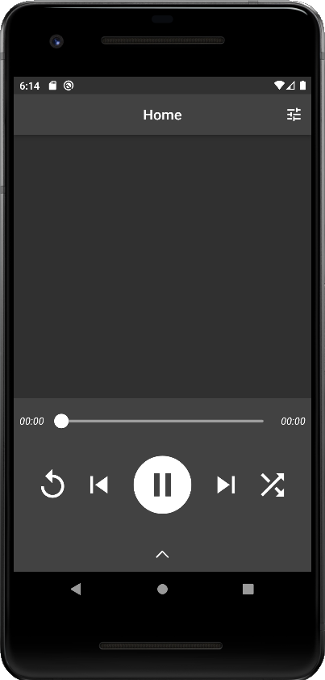
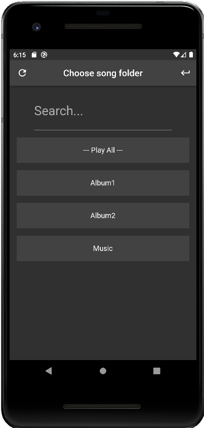
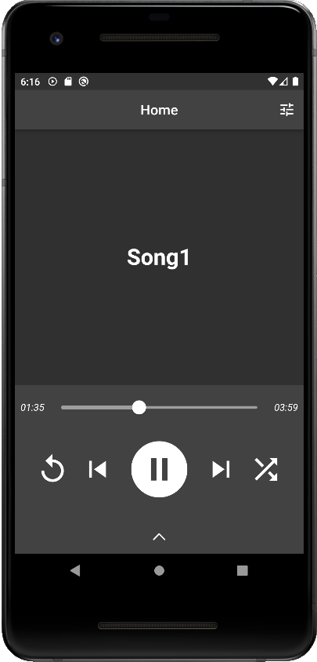
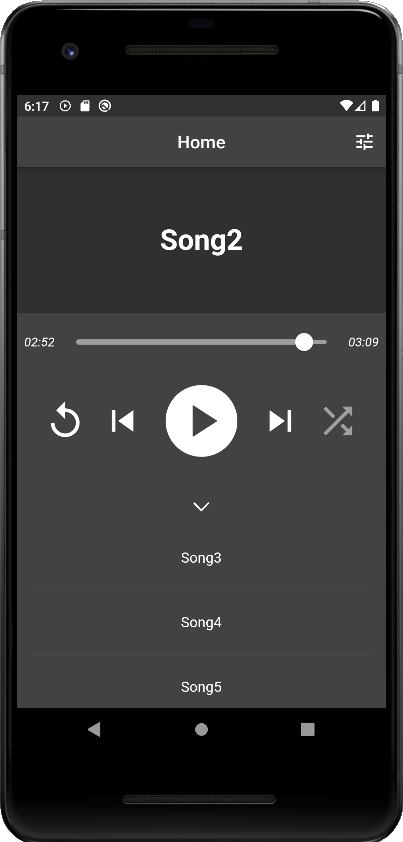

# your_player - Android app using Flutter

YourMusic is an app that aims to allow users to play local songs and easily create playlists by just dropping songs into folders

## Screenshots

## Note
Songs should be placed outside the downloads folder