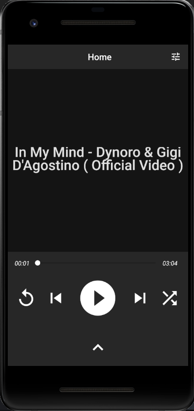
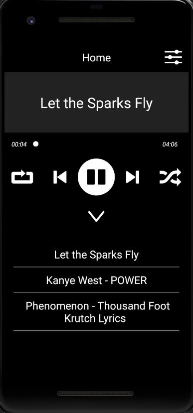

# YourMusic - Android App using ReactNative

YourMusic is an app that aims to allow users to play local songs and easily create playlists by just dropping songs into folders

## Screenshots

## Creating playlists
Just drag and drop your songs into a new folder, for example myplaylist
The file structure would then look like
 - Music
    - myplaylist
        - song1
        - song2
    - mysecondplaylist
        - song3
        - song4
 - Videos 
 - Android

Music can be placed anywhere in your android filesystem, the only requirement are that the songs are .mp3 format!!!